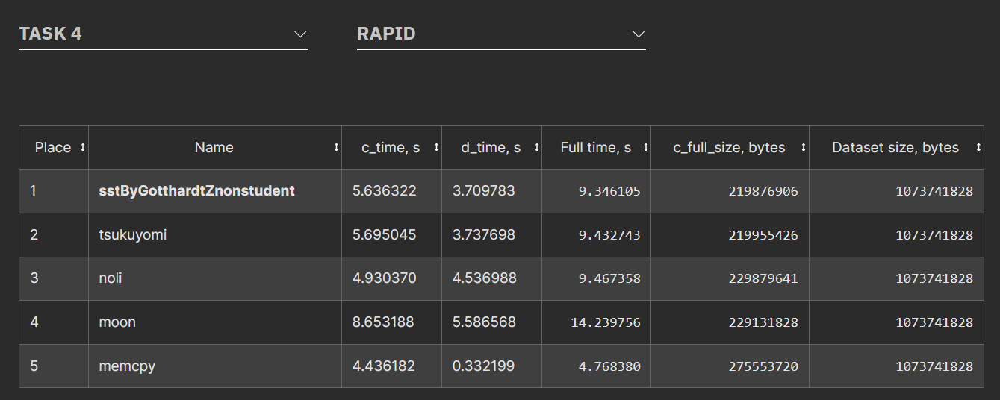

# GDCC2023 submission for Task 4 ("Fast Secondary Stage Transform")

This is the source code of my SST (Secondary Stage Transform) submission for [GDCC 2023](https://gdcc.tech/)  as a non-student entry.
# What' included?
- C++ Source code
- Build script for MinGW-W64 (build-windows.cmd)
- Build script for Linux (build-linux.sh) - used for the submission.
- Visual Studio 2017 solution

## The rules

Quote from [GDCC 2023 'Rules' page](https://gdcc.tech/rules):

### Task 4 – Fast Secondary Stage Transform
Task definition
The goal of this task is to provide fast and efficient implementation of the Second Stage Transform (SST) algorithm for the Burrows-Wheeler Transformed (BWT) input.The transformed data has to be further compressed with the FSE entropy coder (https://github.com/Cyan4973/FiniteStateEntropy). The smaller size of the FSE output on the transformed data the better. Also, the total of forward transform + reverse transform time will be considered.

For example, the SST algorithm for this task could be the Move-to-front transform: https://en.wikipedia.org/wiki/Move-to-front_transform

The MTF:

Input data: a sequence of 8-bit symbols to be coded, stored in an input file. These symbols are to be considered as unsigned values from 0 to 255.
Symbol order list: a list of 256 elements containing all values from 0 to 255 once. The symbol order list is defined as the sorted sequence 0, …, 255 before any symbol is processed.
 
Input symbols are processed in the order they appear in the sequence as follows:

For each symbol, 8 bits are appended to the output. These 8 bits represent the index of the input symbol in the symbol order list. For instance, index 0 indicates that the input symbol appeared in the first position, while index 255 indicates that the input symbol appeared in the last position.
After producing the output, the input symbol is moved to the front of the symbol order list.
 
All output indices are concatenated into an output file. The algorithm continues until the end of file is found.

For example, the input sequence `0 0 5 5 255 255` will be transformed to the following sequence: `0 0 5 0 255 0`

Any other transform can be implemented as long as it allows lossless reconstruction. If lossless reconstruction is not achieved, the submission will be considered invalid.

Submission format
The submission must contain an executable file named `sst` that accepts the following syntax:

`sst t <input_path> <output_path>`
`sst i <input_path> <output_path>`
where

`sst t` applies the direct SST
`sst i` applies the inverse SST
<input_path> is the path to the file with the input data to be coded, and
<output_path> is the path of the file where the MTF-coded data has to be stored.
Test dataset
The Burrows-Wheeler Transformed `Qualitative` dataset will be employed for the evaluation of this task.

Submission evaluation
All submissions for this task will be ranked in a single category. Valid submissions must meet the `Rapid` requirements.

Submissions will be ranked based on the compressed size of transformed data produced by the FSE and total of forward/reverse transform time on the `Evaluation platform`.

For this task, C is the execution time of `sst t`, D is the execution time of `sst i`, S is the size of the compressed data size after applying `sst i` followed by FSE, and F is the submission file size. Note that the execution time of FSE is not considered for this task. Recall that if lossless reconstruction is not achieved, the submission will be considered invalid.

Submissions will be ranked based on the total execution time on the `Evaluation platform`.

## The Solution

As the BWT input has quite a lot of byte repetitions, first it is pre-processed by the RLE3 encoder to shrink its size before processing by the MTF encoder. This gives both a speed boost (less work for the MTF encoder/decoder) and the MTF stage will work more efficiently resulting in smaller final compressed size. 

RLE3 = When the RLE encoder seens 3 consecutive repeating bytes it switches to RLE mode: it encodes a Run Length. Note, that it doesn't have to encode the byte as it's given by what was repeating. As the Run Length tends to be small, it optimistically encodes it in one byte, if it's larger than that, it first sends a 255 to the output then it encodes the remaining Run Length (original Run Lenght - 254) as [LEB128](https://en.wikipedia.org/wiki/LEB128).

After the RLE3 stage the MTF (Move-To-Front) encoding stage follows. The encoding part uses AVX2 code to speed up looking up the byte in the MTF table. An SSE2 function is also supplied alternatively for testing for those who have no AVX2. The decoder is simpler, it just looks up the byte by index - it doesn't need to search. Both the encoder and decorer uses the built-in memmove to do the move-to-front operation.

As the RLE3 stream has both single-byte encoded Run Lengths and LEB128 encoded Run Lengths which have different distributions, we can separate these two sub-streams for a couple of kilobytes of additional gain in final compressed size.
These two RLE streams are not MTF-encoded (they will be directly encoded by the FSE encoder).

Thus, the encoding part emits 3 streams: MTF + RLE3/1 + RLE3/2 which will be FSE-encoded on the evaluation platform and ranked by the score calculated by the ranking formula using both the final compressed size and the encoding/decoding times.

Note that GDCC2023 rules specifically allowed the solution to be fine tuned for the test files or even contain hard-coded parts. This is why the solution here has hardcoded file sizes for simplicity.

# Results

|||
|---|---:|
| Input file size   | 107'371'1828 |
| RLE3 stream1      |   21'499'610 |
|RLE3 stream2       |      15'1296 |
|MTF encoded data   |  375'411'081 |
|Total Output size  |  397'06'1987 |
|FSE encoded size   |  219'873'087 |
|Submission size (executable in zip)   |  3'819  |
|Total size for ranking   |  219'876'906  |

Preliminary results:

## License

MIT
